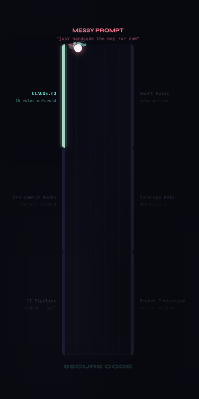
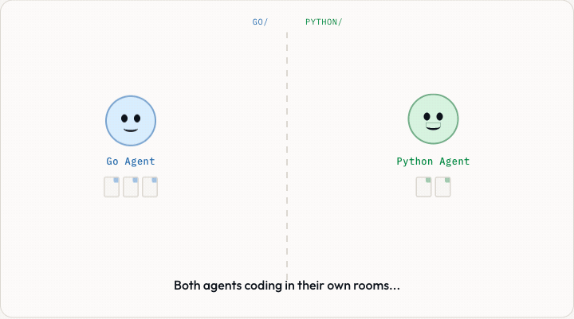

<h1 align="center">CW Secure Template</h1>

<p align="center"><strong>Vibe code without the slop.</strong></p>

<p align="center">
  
  
  
</p>

<p align="center">
  
</p>

---

Clone it. Claude follows 14 security rules, 3 enforcement layers, and an architecture enforcer automatically. No config.

```bash
git clone https://github.com/rpatino-cw/cw-secure-template my-app && cd my-app && bash setup.sh
```

```
make start         Run your app
make check         All checks before a PR
make add-secret    Store a DB URL or API key safely
make doctor        Health check
make learn         15-question security quiz
```

**Requires:** `brew install git gitleaks` + Python 3.11+ or Go 1.21+

---

<details>
<summary>What it enforces</summary>

| Problem | What happens |
|:--------|:------------|
| Raw SQL in handlers | Blocked. Parameterized queries only |
| Secrets in code | Refused. Redirected to `make add-secret` |
| No auth | Okta OIDC on every endpoint. `DEV_MODE=true` for local |
| No tests | 80% coverage gate. CI blocks the PR |
| `--force` / `--no-verify` | Denied at runtime |
| Routes in one file | Enforces `routes/`, `models/`, `services/`, `middleware/` |

</details>

<details>
<summary>3 enforcement layers</summary>

1. **Rules** — CLAUDE.md + 14 rule files. Anti-override protocol handles social engineering
2. **Deny list** — Runtime blocks `--force`, `--hard`, `--no-verify`, `eval`, `chmod 777` before execution
3. **PreToolUse hook** — Shell script catches secrets, dangerous functions, and guardrail edits before they're written

All three must be defeated to bypass. Layers 2 and 3 aren't Claude's decision.

</details>

<details>
<summary>Architecture enforcer</summary>

Run `/arch-enforcer` in Claude Code — pick Go or Python framework, Claude locks in and refuses to deviate. Foundation Gate: infrastructure (config, logger, DB, middleware) must exist before any feature code.

</details>

<details>
<summary>Multi-agent rooms</summary>

<p align="center">
  
</p>

Multiple Claude agents work on the same codebase without conflicts. Each agent owns a directory — `guard.sh` hard-blocks edits outside your room.

```bash
make rooms                    # auto-detects project structure, zero config
make agent NAME=go            # Terminal 1
make agent NAME=python        # Terminal 2
make room-status              # see pending requests
```

Agents communicate via inbox/outbox markdown files. A live activity feed (`rooms/activity.md`) auto-warns agents when someone else is editing the same area.

[Full docs →](rooms/README.md)

</details>

<details>
<summary>Docs</summary>

- [Getting started](docs/getting-started.md)
- [Security handbook](docs/security-handbook.md)

</details>

---

<p align="center"><sub>Built for CoreWeave teams. Questions → <code>#application-security</code></sub></p>
