<h1 align="center">CW Secure Template</h1>

<p align="center">
  <strong>Vibe code without the slop.</strong>
</p>

<p align="center">
  <a href="https://rpatino-cw.github.io/cw-secure-template/"></a>
  <a href="docs/getting-started.md"></a>
  <a href="docs/security-handbook.md"></a>
</p>

<p align="center">
  
  
  
  
</p>

---

<p align="center">
  
</p>

You prompt Claude to build an app. It generates spaghetti — routes everywhere, raw SQL, no auth, no tests. You prompt again and it overwrites what it just wrote. Three sessions later, AI slop.

**This template makes that impossible.** Claude follows enforced rules for file structure, database access, API design, and security. You build at full speed. The app stays organized, secure, and ready to scale — even after 100 prompts.

<br>

<p align="center">
  
</p>

```bash
git clone https://github.com/rpatino-cw/cw-secure-template my-app
cd my-app && bash setup.sh
```

One question — Python or Go. Then you're building.

<br>

## What It Enforces

| Problem | What Claude does in this project |
|:--------|:-------------------------------|
| Routes dumped in one file | Enforces `routes/`, `models/`, `services/`, `middleware/` separation |
| Raw SQL in handlers | Blocks it. Parameterized queries only. Every time |
| Database creds in code | Refuses. Redirects to `make add-secret` (hidden input, `.env`, never committed) |
| Passwords stored plain text | Adds bcrypt/argon2 hashing automatically |
| No auth | Every endpoint gets auth middleware. `DEV_MODE=true` for local testing |
| No tests | 80% coverage gate. 3 test cases per endpoint minimum. CI blocks the PR if missing |
| No input validation | POST/PUT require validated schemas. Raw request bodies rejected |
| Code gets overwritten | `--force`, `--hard`, `--no-verify` all denied. Dropped file detection on every PR |
| Skipped steps | Auth, validation, tests, error handling, headers, rate limiting — all required. Can't skip |
| AI slop | CI runs slop detectors. Boilerplate, redundant wrappers, and junk comments get flagged |

<br>

## Core Commands

```
make start         Run your app
make check         Run all checks before a PR
make add-secret    Safely store a database URL or API key
make doctor        Is everything working? Find out
make learn         15-question security quiz — learn by building
```

In Claude Code:

```
/project:add-endpoint       New API route — auth, validation, tests included
/project:check              Full quality + security scan
/project:security-review    10-point audit with exact fixes
```

<br>

## Claude Teaches You As You Build

This isn't just guardrails. Claude explains every pattern it uses:

```python
# SECURITY LESSON: Never put user input directly in a SQL query.
# This uses parameterized queries — the database treats input as data, not code.
# Without this, an attacker could type '; DROP TABLE users; --' as their name.
cursor.execute("SELECT * FROM users WHERE id = %s", (user_id,))
```

Blocked commits tell you **what happened, why it matters, and how to fix it** — in plain English. You learn backend development while building a real app.

<br>

## Teams

Everyone clones the same template. Same rules, same commands, same structure. The CI pipeline and code reviewer agent enforce consistency. Your app looks like one person built it, even if five people are prompting.

- **Shared rules** — one `CLAUDE.md`, everyone follows it
- **Code reviewer agent** — reviews every PR against the same conventions
- **CODEOWNERS** — no solo merges
- **PR template** — 10-point checklist

<br>

## What Ships With It

- **Pre-wired middleware** — auth (Okta OIDC), rate limiting, request tracking, security headers
- **Git hooks** — secret scanning, linting, security checks on every commit. Can't be disabled
- **8 CI checks** — secrets, CodeQL, coverage gate, dependency audit, slop detection, hook integrity
- **2 AI agents** — security auditor + code reviewer
- **Auto-learning memory** — Claude remembers your project across sessions
- **Kubernetes deployment** — Helm chart with 4 environment configs
- **Docker** — multi-stage, non-root, Chainguard base images

<br>

## Requirements

| Need | Install |
|:-----|:--------|
| Git | `brew install git` |
| Python 3.11+ or Go 1.21+ | `brew install python@3.11` or `brew install go` |
| pre-commit | `pip install pre-commit` |
| gitleaks | `brew install gitleaks` |

<br>

## FAQ

**Do I need to be a developer?**
No. Claude walks you through everything — database setup, secret storage, endpoint creation. You learn by building.

**Can my team use this?**
That's the point. Everyone gets the same guardrails. CI enforces consistency across all contributors.

**What if Claude overwrites my code?**
It can't. Force push, hard reset, and hook bypass are all denied. Dropped file detection catches the rest.

**Will it slow me down?**
No. You don't configure anything. The structure is already there. You just build.

---

<p align="center">
  <sub>Built for teams that ship fast and sleep well. Questions? <code>#application-security</code> on Slack.</sub>
</p>
