<p align="center">
  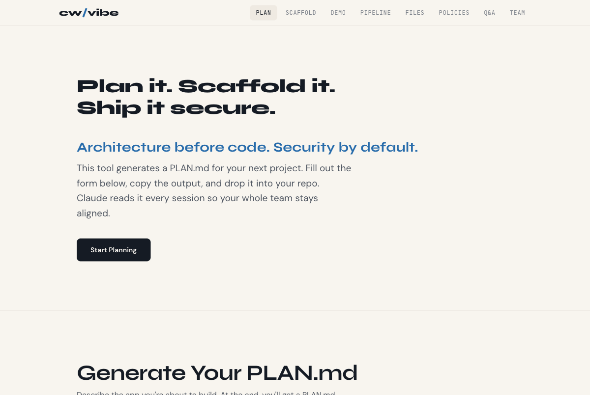
</p>

<p align="center">
  <a href="https://rpatino-cw.github.io/cw-secure-template/"></a>
</p>

---

```
git clone https://github.com/rpatino-cw/cw-secure-template my-app
cd my-app && bash setup.sh
```

```
make start        make check        make help
```

---

<p align="center">
  
</p>

<p align="center">
  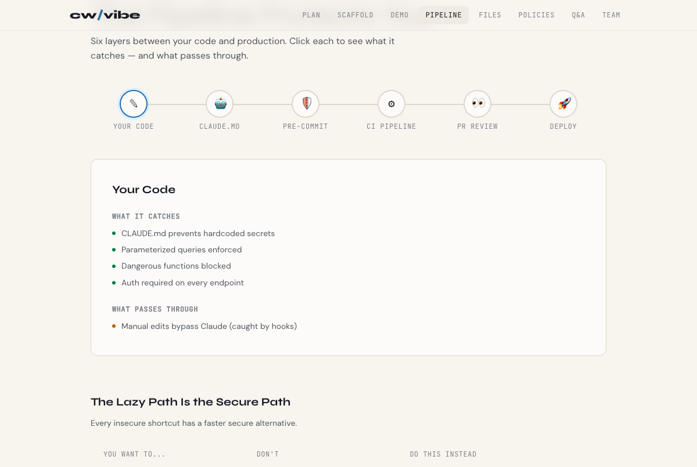
</p>

---

<p align="center">
  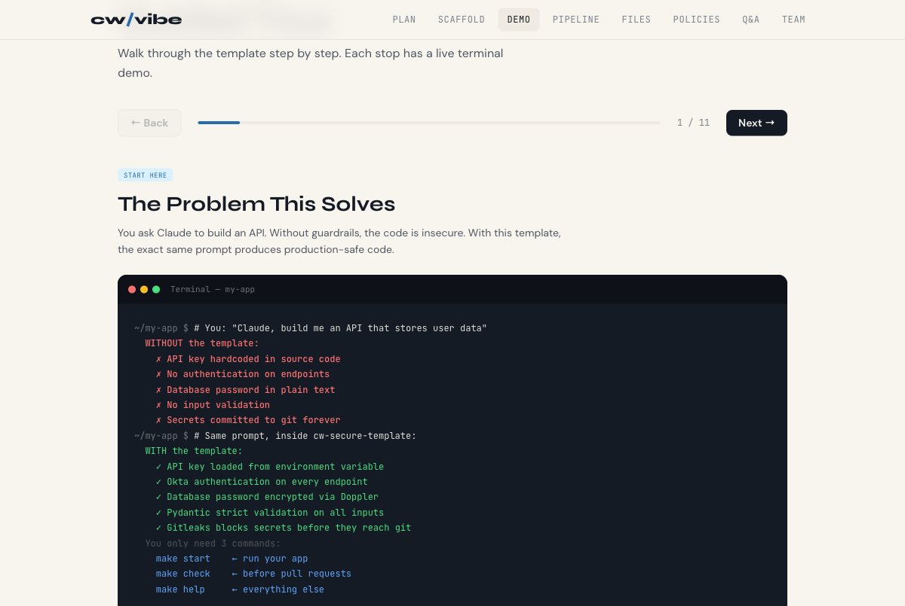
</p>

---

<p align="center">
  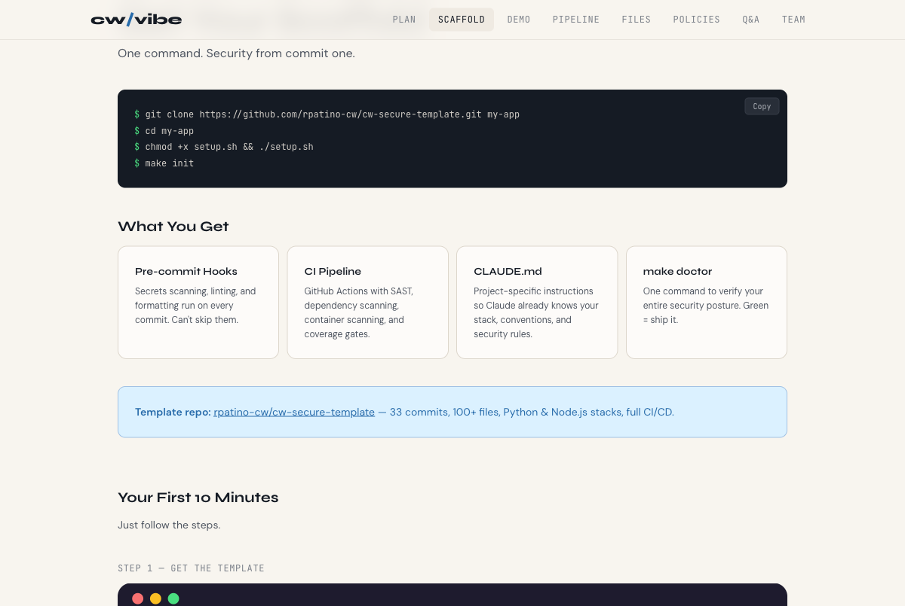
</p>

---

<p align="center">
  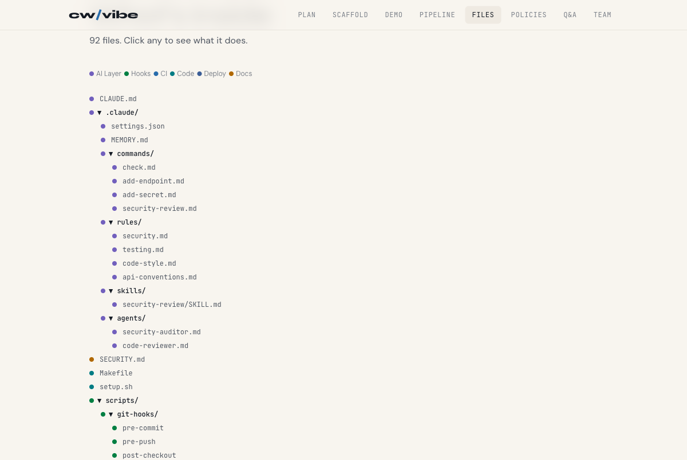
</p>

---

<p align="center">
  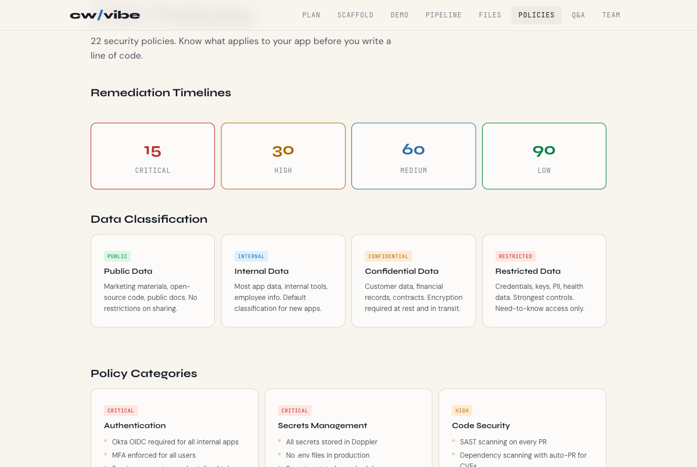
</p>

---

<table>
<tr>
<td></td>
<td></td>
<td></td>
<td></td>
<td></td>
<td></td>
<td></td>
</tr>
<tr>
<td align="center"><sub>Setup</sub></td>
<td align="center"><sub>Pick stack</sub></td>
<td align="center"><sub>Start</sub></td>
<td align="center"><sub>Secrets</sub></td>
<td align="center"><sub>Build</sub></td>
<td align="center"><sub>Commit</sub></td>
<td align="center"><sub>Push</sub></td>
</tr>
</table>

---

<p align="center">
  <a href="https://rpatino-cw.github.io/cw-secure-template/">Platform</a> · <a href="docs/getting-started.md">Getting started</a> · <a href="docs/security-handbook.md">Security handbook</a>
</p>
