<h1 align="center">CW Secure Template</h1>

<p align="center">
  <strong>Vibe code without the slop.</strong>
</p>

<p align="center">
  <a href="https://rpatino-cw.github.io/cw-secure-template/"></a>
  <a href="docs/getting-started.md"></a>
  <a href="docs/security-handbook.md"></a>
</p>

<p align="center">
  
  
  
  
</p>

---

<p align="center">
  
</p>

You prompt Claude to build an app. It generates spaghetti — routes everywhere, raw SQL, no auth, no tests. You prompt again and it overwrites what it just wrote. Three sessions later, AI slop.

**This template makes that impossible.** Claude follows enforced rules for file structure, database access, API design, and security. You build at full speed. The app stays organized, secure, and ready to scale — even after 100 prompts.

<br>

<p align="center">
  
</p>

```bash
git clone https://github.com/rpatino-cw/cw-secure-template my-app
cd my-app && bash setup.sh
```

One question — Python or Go. Then you're building.

<br>

## What It Enforces

| Problem | What Claude does in this project |
|:--------|:-------------------------------|
| Routes dumped in one file | Enforces `routes/`, `models/`, `services/`, `middleware/` separation |
| Raw SQL in handlers | Blocks it. Parameterized queries only. Every time |
| Database creds in code | Refuses. Redirects to `make add-secret` (hidden input, `.env`, never committed) |
| Passwords stored plain text | Adds bcrypt/argon2 hashing automatically |
| No auth | Every endpoint gets auth middleware. `DEV_MODE=true` for local testing |
| No tests | 80% coverage gate. 3 test cases per endpoint minimum. CI blocks the PR if missing |
| No input validation | POST/PUT require validated schemas. Raw request bodies rejected |
| Code gets overwritten | `--force`, `--hard`, `--no-verify` all denied. Dropped file detection on every PR |
| Skipped steps | Auth, validation, tests, error handling, headers, rate limiting — all required. Can't skip |
| AI slop | CI runs slop detectors. Boilerplate, redundant wrappers, and junk comments get flagged |

<br>

## 3 Commands. That's It.

<p align="center">
  
</p>

<br>

## Claude Catches Mistakes and Teaches You Why

<p align="center">
  
</p>

<br>

## Vibe Code With Your Team

<p align="center">
  
</p>

<br>

## What's Already Built

<p align="center">
  
</p>

<br>

## Requirements

`brew install git gitleaks` and Python 3.11+ or Go 1.21+. [Full setup guide](docs/getting-started.md).

---

<p align="center">
  <sub>Built for teams that ship fast and sleep well. Questions? <code>#application-security</code> on Slack.</sub>
</p>
