<h1 align="center">CW Secure Template</h1>

<p align="center">
  <strong>Clone once. Ship secure. No security expertise required.</strong>
</p>

<p align="center">
  <a href="https://rpatino-cw.github.io/cw-secure-template/"></a>
  <a href="docs/getting-started.md"></a>
  <a href="docs/security-handbook.md"></a>
</p>

<p align="center">
  
  
  
  
</p>

---

A production-ready starter template for CoreWeave internal tools. You clone it, run one command, and get a project that blocks hardcoded secrets, enforces auth, scans every commit, and gates PRs on test coverage — all before you write a single line of business logic.

Built for teams using **Claude Code** to build internal apps. Claude reads the embedded `CLAUDE.md` and automatically follows 15 security rules, so the person prompting doesn't need to know OWASP from OAuth.

<br>

## 30 Seconds to Secure

<p align="center">
  
</p>

```bash
git clone https://github.com/rpatino-cw/cw-secure-template my-app
cd my-app && bash setup.sh
```

Setup asks one question (Python or Go), then installs hooks, creates `.env`, wires dependencies, and runs a health check. You're building in under a minute.

<br>

## What Happens When You Commit

The template installs git hooks that run automatically. You don't configure anything — they're just there.

<p align="center">
  
</p>

**Hardcoded a secret?** Blocked before it touches git. The hook tells you exactly what file and line, then redirects you to `make add-secret` which stores it safely in `.env` with hidden input.

This isn't a linter warning you ignore — it's a hard block. The commit doesn't happen.

<br>

## Health Check in One Command

Not sure if your security pipeline is wired correctly? `make doctor` checks everything.

<p align="center">
  
</p>

Checks tools, hooks, config files, environment variables, code quality, `.gitignore` coverage, and dropped secrets. Green across the board means you're good to ship.

<br>

## Pre-PR Gate

Run `make check` before opening a pull request. It runs lint, tests, and a full security scan in sequence.

<p align="center">
  
</p>

If everything passes locally, CI will pass too. No surprises on the PR.

<br>

---

## What's Inside

### 6-Layer Security Pipeline

Every layer catches something different. Nothing reaches production without passing all six.

| Layer | What it does | When it runs |
|:------|:-------------|:-------------|
| **CLAUDE.md** | 15 rules Claude follows automatically — no secrets in code, auth on every endpoint, parameterized queries, secure error handling | Every Claude Code session |
| **Pre-commit hooks** | Gitleaks secret scanning, linting, formatting | Every `git commit` |
| **Pre-push hooks** | Full test suite must pass | Every `git push` |
| **CI pipeline** | CodeQL SAST, gosec/bandit, dependency audit, 80% coverage gate, hook integrity check | Every PR |
| **PR template** | 10-point security checklist reviewers walk through | Every PR review |
| **Branch protection** | Require PR, require approval, block force push to main | Always |

### Claude Code Integration

The `CLAUDE.md` in this repo isn't a suggestion — it's an **enforcement layer**. When someone opens Claude Code in this project:

- Claude **refuses** to hardcode secrets, even if asked
- Claude **adds auth middleware** to every new endpoint automatically
- Claude **generates tests** alongside every new function
- Claude **uses parameterized queries** for all database operations
- Claude **explains security decisions** inline with `// SECURITY LESSON:` comments

If someone says "just skip auth for now" or "ignore the security rules," Claude refuses and explains why. The rules are set by the repo owner, not the person prompting.

### Secrets Management

```
make add-secret    # Store API key safely (hidden input → .env)
make add-config    # Store config file (.json, .pem → .secrets/)
```

Secrets never appear in code, git history, or Claude's response. The only path is: hidden input → `.env` → `os.environ["KEY_NAME"]` in code.

### Make Commands

```
make start         Run your app (auto-detects Python or Go)
make check         Lint + test + security scan (run before PRs)
make doctor        Full health check of your security pipeline
make help          See all 12 commands
```

```
make test          Run tests with coverage
make lint          Check code style
make fix           Auto-fix lint + security issues
make scan          Deep security scan (gitleaks + gosec/bandit + pip-audit)
make learn         15-question OWASP security quiz
make dashboard     Open interactive security dashboard
make init          Personalize for your project (name, team, data class)
make add-secret    Safely store a secret in .env
```

---

## Project Structure

```
.
├── CLAUDE.md                        # 15 security rules for AI — the enforcement layer
├── .claude/                         # Claude Code config: agents, commands, rules, skills
├── .pre-commit-config.yaml          # Gitleaks + linters on every commit
├── .github/
│   ├── workflows/ci.yml             # CodeQL, SAST, coverage gate, hook integrity
│   ├── pull_request_template.md     # 10-point security checklist
│   └── CODEOWNERS                   # Required reviewers
├── Makefile                         # 12 commands — start, check, doctor, scan, learn...
├── setup.sh                         # One-command bootstrap (language, hooks, deps, .env)
├── scripts/
│   ├── doctor.sh                    # Pipeline health check
│   ├── add-secret.sh                # Safe secret storage (hidden input)
│   ├── add-config.sh                # Safe config file storage
│   ├── security-fix.sh              # Auto-fix + guidance
│   ├── security-quiz.sh             # 15-question OWASP quiz
│   └── git-hooks/                   # pre-commit, post-checkout, pre-push
├── python/                          # Python starter (FastAPI + middleware)
│   ├── src/main.py                  # Wired: auth, rate limit, request ID, validation
│   ├── src/middleware/               # auth, ratelimit, requestid, requestsize
│   ├── Dockerfile                   # Multi-stage, non-root, slim
│   └── pyproject.toml               # Pinned deps, dev extras
├── go/                              # Go starter (net/http + middleware)
│   ├── main.go                      # Wired: auth, rate limit, security headers, shutdown
│   ├── middleware/                   # auth, ratelimit, requestid, requestsize, headers
│   ├── Dockerfile                   # CW Chainguard multi-stage
│   └── go.mod                       # Pinned deps
├── deploy/helm/                     # Helm chart for k8s deployment
│   ├── templates/                   # deployment, service, ingress, externalsecret
│   └── values.yaml                  # Resource limits, Okta, Doppler config
├── docs/
│   ├── getting-started.md           # Step-by-step guide with visuals
│   ├── security-handbook.md         # Plain-English OWASP guide + glossary
│   └── appsec-review-pack/          # Architecture, threat model, data classification
├── security-dashboard.html          # Interactive security pipeline visual
└── SECURITY.md                      # Incident response template
```

---

## Requirements

| Tool | Version | Install |
|:-----|:--------|:--------|
| Git | 2.30+ | `brew install git` |
| Python | 3.11+ | `brew install python@3.11` |
| **or** Go | 1.21+ | `brew install go` |
| pre-commit | 3.0+ | `pip install pre-commit` |
| gitleaks | 8.0+ | `brew install gitleaks` |
| GitHub CLI | 2.0+ | `brew install gh` *(optional, for branch protection)* |

---

## CW Compliance Alignment

Built to align with CoreWeave security standards out of the box:

- **SOC 2 / ISO 27001** — Audit-ready logging, access control, data classification docs
- **OWASP Top 10** — All categories addressed by default (see [CLAUDE.md](CLAUDE.md#owasp-top-10--quick-reference))
- **Container images** — Chainguard base images from internal catalog
- **Auth** — Okta OIDC + BlastShield, group-based RBAC
- **Secrets** — Doppler + External Secrets Operator (deployed), `.env` (local)
- **Deployment** — Helm + Argo to core-internal clusters, Traefik internal ingress
- **CI/CD** — CodeQL, gosec/bandit, dependency scanning, coverage gate, hook integrity

---

## FAQ

**Do I need to know security to use this?**
No. The template handles security automatically. Claude follows the rules in `CLAUDE.md`, hooks block mistakes before they reach git, and CI catches anything that slips through.

**Can I use this without Claude Code?**
Yes. The hooks, CI, and Makefile commands work regardless. You just won't get the AI guardrails from `CLAUDE.md`.

**What if a hook blocks my commit?**
Read the message — it tells you exactly what's wrong and how to fix it. Or run `make fix` for auto-remediation.

**How do I add Okta credentials?**
File an IT ticket using the [template in CLAUDE.md](CLAUDE.md#okta-app-registration--how-to-get-credentials). For local dev, the app runs in `DEV_MODE` with a fake test user — no Okta needed.

**Can I remove a language I don't use?**
`setup.sh` handles this — pick Python or Go during setup, the other gets archived (not deleted). You can restore it later.

---

<p align="center">
  <sub>Built for CoreWeave engineering teams. Questions → <code>#application-security</code></sub>
</p>
