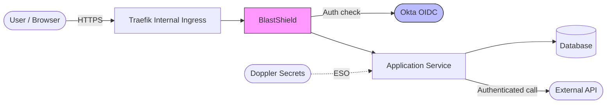

# Architecture Document

## System Overview

**Service name:** `<your-service-name>`

**What does it do?**
<!-- 2-3 sentences describing the service's purpose and core functionality -->
TODO

**Who uses it?**
<!-- Internal users (which teams?), external users, automated systems, other services -->
TODO

**How is it accessed?**
<!-- Web UI, API, CLI, cron job, event-driven, etc. -->
TODO

---

## Architecture Diagram

<!-- Replace this placeholder with your actual architecture diagram. -->
<!-- Use Mermaid, ASCII, or link to an image. The diagram should show: -->
<!--   - Client/user entry point -->
<!--   - Ingress / load balancer -->
<!--   - Application service(s) -->
<!--   - Database / storage -->
<!--   - Auth flow (where Okta OIDC is validated) -->
<!--   - External service calls -->
<!--   - Trust boundaries (mark where internal meets external) -->

> **Note:** Update this diagram to reflect your actual architecture. Mark trust boundaries clearly -- where does the trusted internal zone end and untrusted input begin?

---

## Components

| Component | Technology | Purpose | Data Handled |
|-----------|-----------|---------|--------------|
| Frontend | TODO (e.g., React SPA) | User interface | User input, display data |
| API server | TODO (e.g., Go + chi) | Business logic, API endpoints | Request/response payloads |
| Database | TODO (e.g., PostgreSQL) | Persistent data storage | Application data, user records |
| Cache | TODO (e.g., Redis) | Session/data caching | Session tokens, cached queries |
| Worker | TODO (e.g., async job processor) | Background task processing | Job payloads |

> Remove rows that don't apply. Add rows for any additional components.

---

## External Dependencies

| Service | Purpose | Auth Method | Data Exchanged |
|---------|---------|-------------|----------------|
| Okta | User authentication (OIDC) | OAuth2 / JWKS | ID tokens, group claims |
| Doppler | Secrets management | Service account (ESO) | Env vars, API keys |
| TODO | TODO | TODO | TODO |

> List every external service your application calls or depends on.

---

## Network Boundaries

**Cluster:** `<cluster-name>` (e.g., `core-internal`)

**Namespace:** `<namespace>`

**Internal only?** Yes / No
<!-- If no, explain why public access is needed and confirm AppSec has approved it -->

**Ingress configuration:**
- Type: Traefik internal ingress
- TLS: Terminated at ingress (cert-manager)
- Access: BlastShield + Okta OIDC

**Network policies:**
<!-- Does the namespace have NetworkPolicies restricting ingress/egress? -->
<!-- Which other namespaces or services can reach this service? -->
TODO

**Egress:**
<!-- What external hosts does the application need to reach? -->
<!-- List hostnames and ports. This informs network policy configuration. -->
TODO

---

## Data Flow

Describe how data moves through the system from entry to storage to response.

### 1. Data entry
<!-- How does data enter the system? (user input, API call, webhook, event, file upload) -->
TODO

### 2. Authentication and authorization
<!-- How is the request authenticated? How are permissions checked? -->
- User authenticates via Okta OIDC (BlastShield handles the auth flow)
- Group claims from Okta are mapped to application roles
- Authorization checked on every endpoint using middleware

### 3. Processing
<!-- What does the application do with the data? (validate, transform, enrich, compute) -->
TODO

### 4. Storage
<!-- Where is data persisted? What format? Encrypted at rest? -->
TODO

### 5. Response
<!-- What data is returned to the caller? Any sensitive fields filtered out? -->
TODO

### 6. Logging
<!-- What gets logged? Where do logs go? What is explicitly NOT logged? -->
- Structured JSON logs to stdout (collected by log aggregator)
- Auth events (login, logout, permission denied) are logged
- Secrets, tokens, PII, and Authorization headers are never logged
- All log entries include `request_id` and `user_id` (if authenticated)

---

*Prepared using [cw-secure-template](https://github.com/coreweave/cw-secure-template) AppSec Review Pack.*
