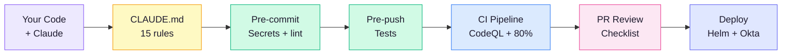
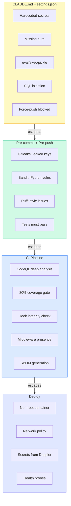
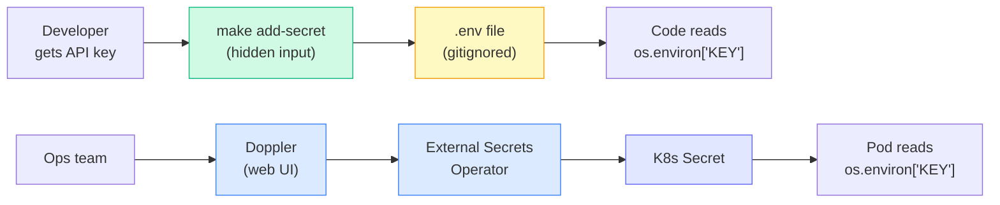
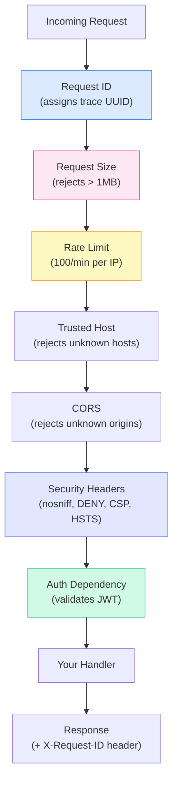
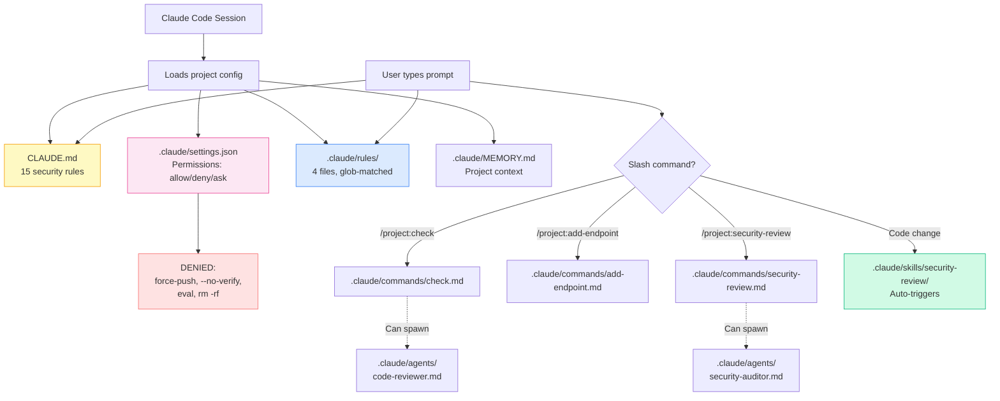
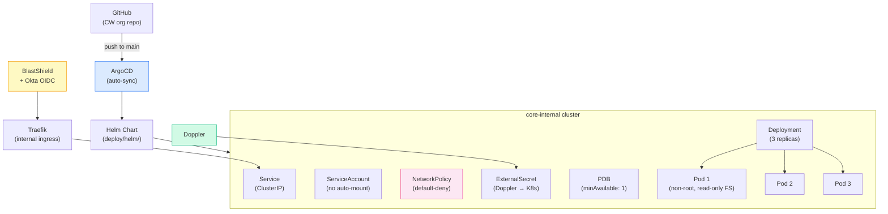
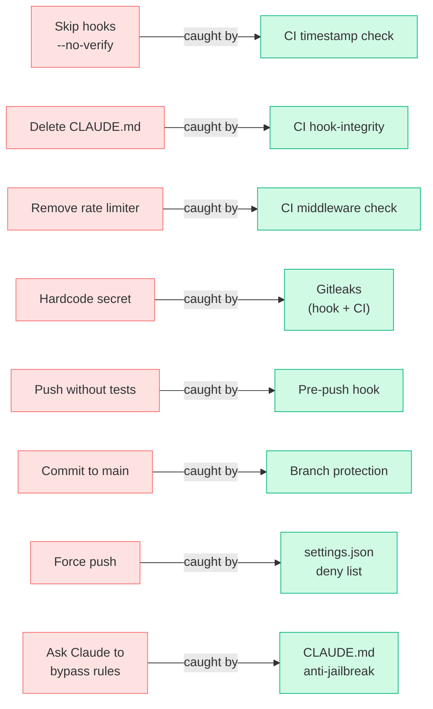

# Architecture

Visual diagrams of how the CW Secure Template works. All diagrams render natively on GitHub.

---

## The 6-Layer Pipeline

How your code flows from editor to production.

---

## What Each Layer Catches

---

## Authentication Flow

How Okta OIDC works in this template.

```mermaid
sequenceDiagram
    participant User
    participant App
    participant Okta
    participant JWKS

    User->>App: GET /api/data
    App->>App: Extract Bearer token from header

    alt DEV_MODE=true
        App->>App: Inject fake test user
        App-->>User: 200 + data
    else Production
        App->>JWKS: Fetch public keys (cached 1hr)
        JWKS-->>App: RSA public keys
        App->>App: Verify JWT signature + expiry + issuer + audience
        App->>App: Extract user claims + groups

        alt Valid token + authorized group
            App-->>User: 200 + data
        else Invalid token
            App-->>User: 401 Unauthorized
        else Wrong group
            App-->>User: 403 Forbidden
        end
    end
```

---

## Secret Flow

How secrets move from developer to production without touching code.

---

## Middleware Stack (Python)

Order matters. First registered = outermost = runs first on request.

---

## `.claude/` Folder Structure

How Claude Code reads project configuration.

---

## Deployment Architecture

How the app runs in production on CW infrastructure.

---

## "Can't Break It" — Escape Route Map

Every bypass attempt and what catches it.

